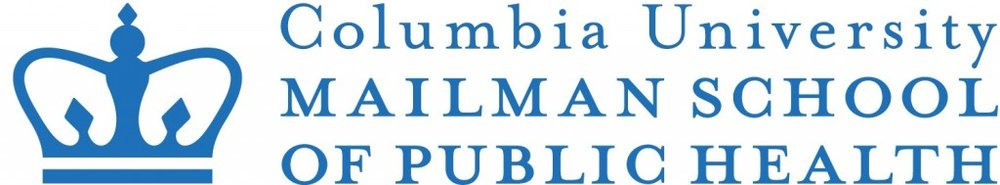

My name is Yixuan Wang. I graduated in May, 2019 from Columbia University Mailman School of Public Health, with a Master of Public Health in Epidemiology and a certificate on Applied Biostatistics.
\
\
If you would like to know more about me, please click [here](about.html) to see my resume. Also please feel free to contact me via email or [linkedin](https://www.linkedin.com/in/yixuan-wang-540972156/) message. 
\
\
\
\

